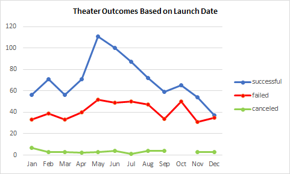
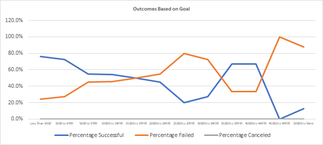

# An Analysis of Kickstarter Campaigns

## Overview of Project

This project analyses Louise's Kickstarter campaigns, aiming to develop data insights to uncover trends in the plannig process of the theater campaigns

### Purpose

Analyze the outcomes of the theater campaigns based on the launch date

Analyze the outcomes of the plays based on the funding goal

***

## Analysis and Challenges

### Analysis of Outcomes Based on Launch Date

### Analysis of Outcomes Based on Goals

***

## Challenges and Difficulties Encountered

*I struggled with the Canvas instructions on how to clone and push changes to GitBash, but I received assistance and quickly understood the process*

***

## Results

- **What are two conclusions you can draw about the Outcomes based on Launch Date?**

*May was the month that launched the most successful Theather campaigns, follow by June and July. In adittion, there were no campaign cancellations throughout the year. However this pattern was also mirrored in a minor scale by failed campaigns*

*December was the month with least succesful campaigns, buttressed by an increase in failed campaigns*

- **What can you conclude about the Outcomes based on Goals?**

*Failed campaigns had higher fundraising goals than succesful campaigns*

- **What are some limitations of this dataset?**

*It does not provide a complete analysis of all sources of income such as backers*

- **What are some other possible tables and/or graphs that we could create?**

*It would be helpful to count the number of backers for each outcome to stimate the percentage of backers in the succesful campaigns versus failed campaigns*
